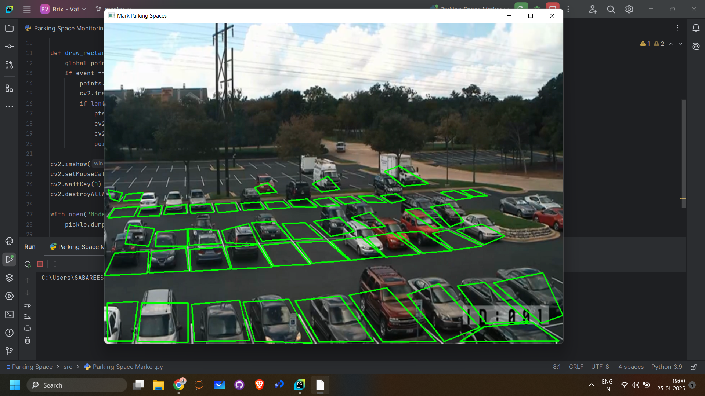
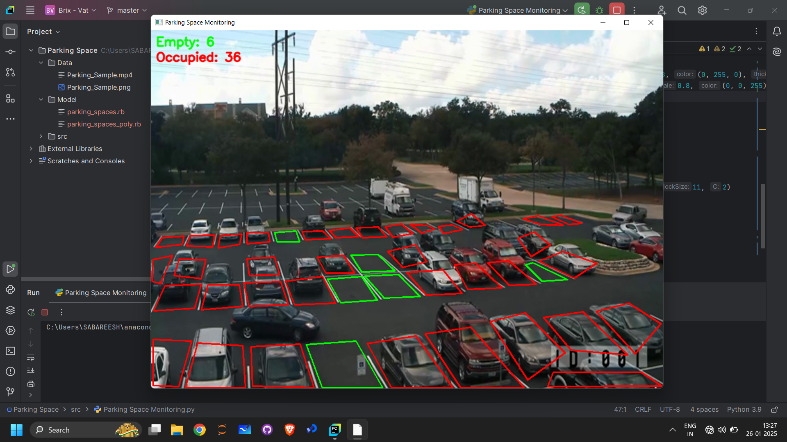

# Real-time Parking Slot Monitor

 This project allows the user to mark the parking lot and moniter them in real-time.

 

## Working

- Step 1 : Mark the parking slot using Parking_Space_Marker.py

- Step 1 : Mark the parking slot using Parking_Space_Marker.py

- Step 2 : After exporting the co-ordinates, run Parking_Space_Monitoring.py.

